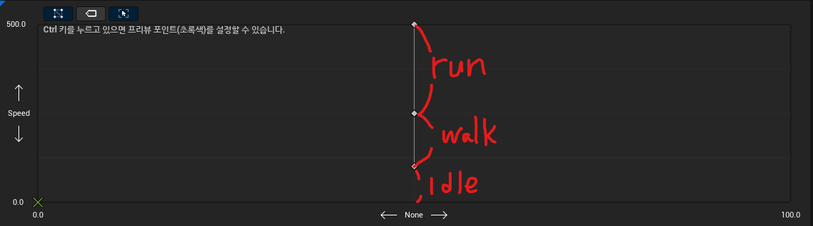

# TIL 02.27
<h3> Unreal Blueprint</h3>
<h4>애니메이션</h4>

Animation Blue Print(ABP) 사용 
1. 애니메이션 에셋만 사용
> 1. assetBrowser에서 원하는 애니메이션을 드래그하여 가져온 뒤 Outpt Pose에 연결
> 2. BP의 Anim Class에 원하는 ABP을 등록
2. Blend Space 사용
> 1. Blend Space(BS) 생성
> 2. 디테일 패널의 Axis Settings의 가로축, 세로축 세팅
> 3. Asset Browser에서 원하는 애니메이션을 가져와 배치 
>    * 각 애니메이션을 shift를 누른채 드래그 하면 분할된 그리드의 경계에 쉽게 배치 가능 
> 4.  ABP에 생성한 BS을 추가해 가로축, 세로축에 값 지정 및 Output Pose에 연결

- 현재 Speed 값에 따른 다른 애니메이션 변경
<h4>액터 이동</h4>

* Event Tick과 Add Acctor Local Rotation 사용
* 여러 환경에서 같은 결과를 내기 위해 Event Tick의 Delta Seconds 사용

    **이동하는 액터** 
    - Delta Seconds을 사용해 구한 이동할 값을 Get Actor Location에 더해 Set Actor Location에 연결

<h4>충돌</h4>

**회전하는 액터** 
- Viewport에 Collision 추가 및 Collision 크기 조정
- Event ActorBeginOverlap을 사용해서 충돌 시작 시점을 감지
- Delta Seconds을 사용해 구한 회전할 값을 Get Actor Location에 더해 Set Actor Location Rotation에 연결
- Event ActorEndOverlap을 사용해 총돌 종료 시점을 감지

**점프 패달** 
1. 충돌 시작 시점에서 구현
2. Cast To BP_...을 통해 해당 BP에 접근
3. Launch Character에 Cast To ...로 가져온 BP에 원하는 Velocity의 힘을 가함

<h4>딜레이</h4>

* Duration 값 만큼 대기 했다가 다음 노드 실행
---
<h3>알고리즘</h3>

**9549 암호화된 비밀번호** 
슬라이딩 윈도우 사용 
범위(원본 비밀번호)을 지정하여 알파벳 갯수를 비교 

1. 슬라이딩 윈도우로 이동하고 비교하고 중단을 break가 아닌, continue을 사용하여 중단되지 않음
2. 입력 값 중 암호화된 결과물로 주어진 문자열이 원래의 비밀번호 보다 짧은 경우를 고려하지 않음

    1. 원래 비밀번호 길이만큼 초기값을 설정하는 과정에서 **암호화된 비밀번호의 길이를 넘어선 값에 접근하지 않도록** 보정 로직 추가
    2. 1번의 상황은 항상 조건을 성립하기 않으므로 초기값 설정 전 두 문자열의 길이를 비교하여 **원래의 비밀번호가 더 긴 경우 조기 중단**하는 로직으로 수정

---
<h3>C/C++</h3>
<h4>함수</h4>

* 스택 프레임
    - 스택 프레임: 함수가 호출되어 사용될 때 해당 함수를 위해 확보된 메모리 공간
    - 스택 프레임은 스택 포인터, 베이스 포인터, 스택 프레임으로 구성되어 있음

* 스코프
    - 스코프: 변수나 함수의 유효 범위
    - 블럭 스코프: 조건문, 반복문 같은 문에 사용되는 중괄호 범위
        - 바깥쪽 블럭 스코프에서 안쪽 블럭 스코프 접근 불가능
        - 바깥쪽 블럭 스코프에 선언된 변수는 안쪽 블럭 스코프에서 접근 가능
    - 변수 가리기: 바깥쪽 블럭 스코프에서 선언한 변수를 안쪽 블럭 스코프에서 선언(사용 X)
    - 파일 스코프: 파일에 작성된 경우

* 전방 선언: 함수의 원형만 따서 파일 스코프 상단에 두고, 함수의 정의는 파일 스코프의 하단에 위치 시키는 방법

* 변수의 종류
    - 지역 변수: 블럭 스코프 내에 선언된 변수, 함수가 종료되면 접근 불가능
        - 정적 지역 변수 
        static: 데이터 섹션에 저장됨, 함수가 종료되어도 값이 유지됨
    - 전역 변수: 파일 스코프에 선언된 변수
        - 정적 전역 변수 
        전역 변수 앞에 static 키워드가 붙는다면, 해당 파일 내에서만 접근 가능함
    -const 변수: 초기화 이후 값을 변경 불가능, 초기화가 강제됨

<h4>포인터</h4>

* 포인터: 메모리 주소를 저장하기 위한 변수
    - 자료형* 변수명 = 메모리 주소값

* 주소 연산자(&): 피연산자의 메모리 주소를 반환하는 연산자 '&'을 사용함

* 역 참조 연산자(*): 피연산자로 포인터를 받아서, 해당 메모리 주소에 저장된 값을 읽거나 값을 수정할 때 사용하는 연산자

* NULL 포인터
    - #define NULL((void*)0) -> 아무것도 가르키지 않은 포인터
    NULL 포인터의 쓰임새
    1. 포인터의 초기화
    2. 포인터가 더이상 사용중이지 않음을 알리고 싶을 때
    3. 포인터가 유효한 메모리 주소를 저장하고 있는지 확인할 때
    - void 포인터: 범용 포인터 
    void* 변수명 = 메모리 주소값;
    1. 역참조 연산 불가능
    2. 정수를 더하거나 빼는 연산은 불가능