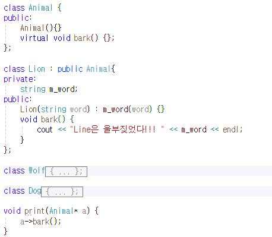

# TIL 3.05
<h3>알고리즘 문제 풀이</h3>
<h4>13975 파일 합치기 3</h4>

**아이디어**
1. 파일의 크기의 최솟값 2개을 합치고, 합친 값을 리스트에 삽입
2. 1의 과정에서 항상 정렬되어 있어야함

**회고** 
1. 알고리즘 선정(set -> multiset(중복된 값도 처리 필요) -> priority_queue(매번 최솟값 2개만 확인 필요))
2. int overflow을 고려하여 priority_queue는 long long으로 선언하였으나 출력값을 저장해 놓는 변수를 int로 선언하여 수정

<h4>11723 집합</h4>

**아이디어**
1. 이미 있는 경우에 추가하는 연산을 무시한다 -> 중복 비 허용(map/set)
2. 키 값 필요하지 않음 -> set 사용
3. find()로 check와 toggle에서 해당 값이 있는지 판단하는 근거로 사용

---
<h3>게임 개발자를 위한 Cpp 문법</h3>
<h4>포인터와 레퍼런스</h4>

* 포인터: 변수를 주소를 저장
    - 타입* 변수명
    - 역참조: 역참조 연산자(*)을 활용해 해당 주소에 있는 실제 값을 읽고, 수정 가능

    * 포인터 배열: 포인터를 원소로 갖는 배열(ex. int* ptrArr[4])
    * 배열 포인터: 배열 전체를 가리키는 포인터
    * 포인터 연산 => 메모리 주소의 이동
        * ptr +1 -> ptr이 가리키는 주소에서 한 단위 메모리 주소 이동
        * (*ptr) +1 -> ptr가 가리키는 변수의 값을 1 증가
        * *(ptr + i)와 ptr[i]와 동일
    
* 레퍼런스: 변수에 다른 이름을 부여 
    ex) int& ref = var; 
    ref의 값 변경 시 var의 값도 변경

* 포인터 vs 레퍼런스
    * 선언 및 초기화
        1. 포인터 - 선언 후 = 연산자를 통해 가리킬 대상을 변경 가능
        2. 레퍼런스 - 선언과 동시에 초기화해야함
    * NULL, nullptr
        1. 포인터 - 유효한 대상이 없음을 나타내기 위해 NULL 이나 nullptr으로 초기화 가능
        2. 레퍼런스 - 항상 다른 변수와 연결되어 있어야함
    * 간접 참조 문법
        1. 포인터 - 접근(*), 주소를 가져올 때(&)
        2. 레퍼런스 -  일반 변수와 동일

<h4>Class</h4>

* class - 멤버 함수(동작), 멤버 변수(데이터)로 구성
    * 내부 구현
    1. 클래스 내부에서 멤버함수를 직접 정의
    2. 클래스 내부에서 멤버 함수의 선언만 작성하고, 클래스 외부에서 구현

    * class에서 접근 지정자를 명시하지 않으면 private로 설정

* getter & setter
    * 멤버 변수를 바꿀 때 -> setter
    * 값을 가져올 때 -> getter

* 생성자 
객체를 생성할 때마다 한 번식 자동으로 호출되는 특별한 멤버함수

* ifndef 
ex. #ifndef student_h -> student_h가 정의되어 있지 않은 경우만 아래 코드를 실행해라

* enfif: ifndef가 끝났다는 것을 알려줌

<h4>객체지향 프로그래밍</h4>

* 상속: 하나의 기본 클래스를 정의하고, 공통 속성을 구현
    * 생성자는 멤버 초기화 리스트를 통해 멤버 변수들을 초기화할 수 있습니다.
    * 자식 클래스의 생성자는 부모 클래스의 생성자를 호출할 수 있습니다.

* 다형성: 기본이 되는 클래스를 만들어 함수의 인터페이스를 정의하고, 실제 구현은 파생 클래스에서 담당하게 하는 기법
    * virtual -> 가상 함수 테이블 생성
    

    * 순수 가상 함수: 기본 클래스에서 구현하지 않고, 반드시 파생 클래스에서 구현하도록 강제하는 가상 함수 
    ex) virtual int 함수명() = 0

    ---
    **UML**
    * 클래스
        1. 1칸 - 클래스 이름 
        ClassName
        2. 2칸 - 속성(필드/멤버 변수) 
        attributeName: Type
        3. 3칸 - 연산(메서드/함수) 
        operationName(param: Type): ReturnType
    * 접근 지정자(Visibility) 기호
        * +: public
        * -: private
        * #: protected
        * ~: 소멸자
