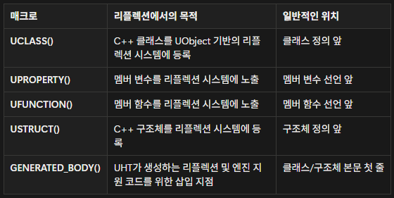

# TIL 3.05
<h3>알고리즘 문제 풀이</h3>
<h4>11057 오르막 수</h4>

**아이디어**
1. 입력값 n <=1000 이므로 1000자리, 일반 적인 방법으로 구현하면 시간 초과 -> dp 사용
2. 자리수와 뒷자리수의 공간을 할당하여 dp[a][b] = dp[a-1][1~b]으로 dp값 초기화
3. 모든 dp값을 합산

---
<h3>Ch2 HW02</h3>
<h4>전직 시스템과 전투 시스템</h4>

**요구사항**
1. class을 따로 헤더와 코드를 만들어서 관리
2. 클래스의 변수에 대한 getter, setter 함수 구현
3. switch나 if문을 사용하여 직업 선택 구현
4. 직업 선택 이후에 공격 실행

**도전&추가 구현 사항**
    
*도전*
1. Monster class 추가
2. 플레이어 공격, 플레이어에게 공격 받은 상황을 함수로 구현
3. 공격 받은 이후 남은 HP에 따라 다른 text 출력

*추가 구현 사항*
1. 플레이어 공격 이후 몬스터가 살아있을 경우 몬스터도 플레이어를 공격하도록 변경
2. 플레이어가 몬스터의 공격으로 죽은 경우 text로     알려주고, 이후 나오는 능력치 창에서 HP가 음수로 표기 되지 않도록 수정

<h3>게임 개발자를 위한 Cpp 문법</h3>
<h4>자원 관리</h4>

* 스택 메모리 
특징: 변수의 생존 주기가 끝나면 선언 시 할당되었던 메모리가 자동으로 회수됨 
    **단점** 
    1. 할당  가능한 스택 메모리의 크기가 제한적임
    2. 메모리를 더 길거나 유연하게 관리하기 어려움

* 힙 메모리 
특징: 동적 할당 시 new 연산자를 사용하고, 해제 시 delete 연산자를 사용함 / 생존 주기는 사용자가 delete로 해제할 때까지 유지됨

* Dangling Pointer: 이미 해제된 메모리의 주소를 계속 가지고 있는 포인터

* Memory Leak : 동적으로 할당한 메모리를 해제하지 않아 사용하지 않는 메모리가 쌓이는 현상

* 스마트 포인터: new/delete을 사용하지 않는 자동 메모리 관리 
    #include\<memory> 사용

    * unique_ptr: 객체에 대한 **단일 소유권**을 관리 / move를 통해 소유권을 이동하는 식으로 관리
        * unique_ptr는 복사가 불가능
        * make_unique<type>(크기)로 사용

    * shared_ptr: **레퍼런스 카운트**를 관리함 / 현재 객체가 참조하는 포인터의 개수를 카운트해, 카운트가 0이 되면 자동으로 메모리 해제
        * 복사 및 대입 연산으로 여러 개의 포인터가 하나의 객체를 공유 가능
        * make_shared<type>(크기)로 사용
        * ues_count()로 현재 객체를 참조하는 포인터의 수를 확인 가능
        * reset()으로 참조 해제

    * weak_ptr: 객체의 소유권을 공유하지 않음(약한 참조) / shared_ptr의 순환 참조 문제를 해결하기 위해 사용
        * lock() 호출 후 반환된 shared_ptr가 유효한지 확인 후에 사용(ex. if(auto a_shared = a_ptr.lock()) )

* 얕은 복사 & 깊은 복사
    * 얕은 복사: 클래스의 포인터 멤버를 복사할 때 포인터가 가리키는 데이터가 아닌 포인터가 저장하고 있는 주소값만 복사하는 것
    * 깊은 복사: 동적 데이터를 새로 할당된 독립적인 메모리 영역에 복제하는 것

* 언리얼 엔진의 메모리 관리
    * 가비지 컬렉션 시스템 - 마크 & 스큅 알고리즘  
    주기적으로 프로그램에서 더 이상 사용되지 않는다고 판단되는 UObject들을 메모리에서 제거
        1. 루트셋  
        항상 살아있다고 간주되는 특별한 객체를 식별합니다
        2. 마크단계 - 도달 가능성 분석 
        루트셋에서 직간접적으로 참조하는 UObject을 마크합니다. 이는 객체가 사용중임을 나타냅니다.
        3. 스윕 단계 - 메모리 회수 
        마크 단계 이후, 마크되지 않은 객체들이 차지하는 메모리를 회수합니다.

        * RF_RootSet: 이 플래그가 설정된 객체는 루트셋의 일부로 관리됩니다. 
        AddToRoot()로 설정하고, RemoveFromRoot()로 해제할 수 있습니다
        * RF_BeginDestroyed: 객체가 실제로 메모리에서 해제되기 전에 필요한 정리 작업을 수행하는 함수
        * RF_FinishDestroyed: 객체 소멸의 마지막 단계로, 이 함수 호출 후 객체의 메모리가 완전히 해제됨
    * 언리얼 - 리플렉션 시스템
        * 리플렉션 시스템: 사용자가 정의한 타입을 처리할 수 있도록 타입 정보를 공유하는 과정
        
        리플렉션 -> UObject를 위한 운영 체제

        * UHT 코드 생성기 - Cpp 컴파일러가 수행되기 전에 동작 / Cpp 코드 내에서 메타 데이터를 얻고, 내부적으로 소스 코드를 생성 -> Cpp 컴파일러 수행

        리플렉션 매크로 
        