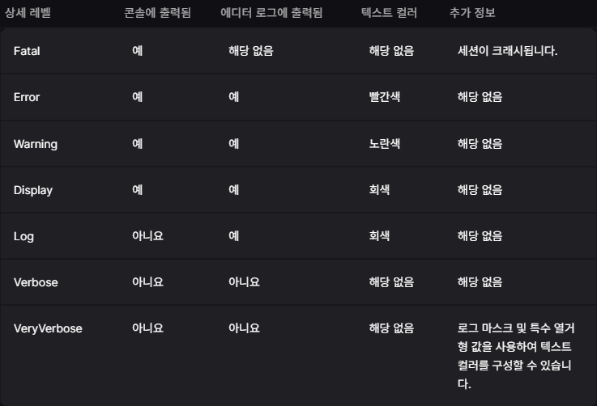

# TIL 3.16
<h3>알고리즘 문제 풀이</h3>
<h4>12906 새로운 하노이 탑</h4>

* 알고리즘
    * BFS
    * map

* 아이디어
    1.  3개의 막대의 상태를 string으로 저장
    2. 각 줄에 막대가 비워져 있지 않다면 다른 줄로 옮겨 bfs
    3. 방문 정보는 map<string, int>로 관리

<h4>1463 1로 만들기</h4>

* 알고리즘
    * dp(다이나믹 프로그래밍)
* 아이디어
    1. 정수 x에 대해 3개의 연산을 한 값을 비교해 최솟값을 구해야함
    2. 시간 제한이 0.15초로 매우 짧으니 같은 연산을 반복해서 하지 않도록 dp 사용

---
<h3>게임 개발자를 위한 Cpp 문법</h3>
<h4>Unreal Engine 기본 개념</h4>

**특징**
* 실시간 렌더링 기능
* 블루 프린트
* 다양한 플랫폼 지원
* 활성화된 커뮤니티

* UE_Log
    * 카테고리: 태그, 자신이 만들수도 있음 / 특정 카테고리만 분류해서 보고 싶을 때 활용됨
    * 심각성
        * **Log/Display**: 메시지를 콘솔 및 로그 파일에 출력합니다.
        * **Warning**: 콘솔 및 로그 파일에 출력하고, 커맨드릿과 에디터가 경고를 수집하고 보고합니다.
        * Error: 콘솔및 로그파일에 출력하고, 커맨드릿과 에디터가 오류를 수집하고 보고합니다. 그 결과로 커맨드릿 실패가 발생합니다.
        * Fatal: 항상 치명적인 로그를 콘솔 및 로그 파일에 출력한 후 크래시를 발생시킵니다.
    * 실제 출력할 내용

    ```
    UE_LOG(카테고리, 심각성, 출력할 내용);
    
    UE_LOG(LogTemp, Log, TEXT("Hello World"));
    ```
    * **주의사항**: UE_Log는 매크로 이므로 전처리기 치환 결과 여러줄일 수 있음 -> 중괄호 생략 불가

* 자체 로그 카테고리 정의
* 예시
    ```
    //선언
    DECLARE_LOG_CATEGORY_EXTERN(<LOG_CATEGORY>, <VERBOSITY_LEVEL>, All);

    // include 아래에 선언
    DEFINE_LOG_CATEGORY(<LOG_CATEGORY>);

    //사용
    UE_LOG(<LOG_CATEGORY>, <VERBOSITY_LEVEL>, TEXT("My log string."));
    ```
    * <LOG_CATEGORY>: 커스텀 로그 카테고리 스트링
    * <VERBOSITY_LEVEL>

        