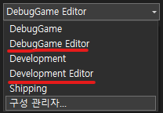
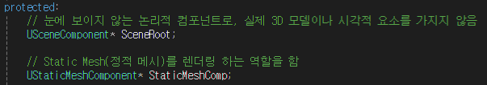

# TIL 4.06
<h3>알고리즘 문제 풀이</h3>
<h4>1083 소트</h4>

* 알고리즘
    * 그리디 알고리즘
* 아이디어
    1. 입력된 배열을 순회하며, 남은 swap 횟수 안에서 현재 인덱스의 값을 가장 크게 만들 수 있는 값을 탐색
    2. 1에서 탐색한 값으로 swap 및 그 비용(탐색 값에서 현재 인덱스까지 swap하는데 필요한 비용)을 s에서 줄임
    3. 배열을 모두 순회하거나, s가 0이하가 되면 결과를 출력

* 회고
    1. 문제 설명 및 예시에 대한 잘못된 이해로 매 swap시 사전 순으로 가장 뒷서는 것으로 판단함
    2. 첫번째 값에서 사용 가능한 비용 안에서 사전 순으로 가장 뒷서는 배열로 만들수 있도록 수정

---
<h3>Cpp과 Unreal로 3D 게임 개발</h3>
<h4>언리얼 엔진 Cpp 빌드 프로세스 이해하기</h4>

* Solution Explorer
    * Engine: 엔진 자체 소스 코드와 리소스가 담김
    * Games: 우리가 만든 프로젝트 코드가 담김
    * Programs
    * Visualizers

* Games/Project -> Set as StartupProject
    * F5 -> 빌드 결과의 언리얼 에디터가 바로 실행됨
        * Development Editor / DebugGame Edior로 설정 되어 있어야함

            

<h4>Cpp Actor 클래스 생성 및 삭제하기</h4>

* 마이그레이트(이주) -> 다른 프로젝트로 가져감

* Actor & Object
    * Object
        * 모든 클래스의 최상위 부모 클래스
        * 월드에 배치 불가능
        * 주로 데이터나, 로직을 담당함 
    * Actor
        * 월드에 직접 배치할 수 있는 클래스
        * 여러 컴포넌트를 추가로 붙일 수 있음
        * 보이고, 상호작용하는 캐릭터, 몬스터, 무기, 조명, 파티클 등

* Actor 생성
    * public으로 생성
        > Public -> .h 가 Public 폴더, .cpp가 Private 폴더에 생성
        <br>
        > Private -> .h와 .cpp모두 Private에 생성
* Cpp 클래스 삭제
    1. VisualStudio에서 .h와 .cpp 삭제
    2. 프로젝트 폴더에서 물리적 파일 삭제

<h4>Actor 클래스에 컴포넌트 추가하기</h4>

* 기본 생성 구조
    * 헤더 파일
        * **pragma once**: 동일 헤더가 여러 곳에서 호출되더라도 한번만 처리 되도록 함
        * **CoreMinimal**: 언리얼에서 엔진 전역 타입, 매크로, 함수 등을 가져옵니다.
        * **GameFramework/Actor**: Actor에 대한 정보를 가진 헤더 파일
        * **(ClassName).generated.h**: (리플렉션 시스템)코드를 블루프린트에서 볼수 있게끔 해줌
        * **UCLASS**: 해당 클래스를 리플렉션 시스템에 등록하는 매크로
        * **GENERATED_BODY()**: 이 모듈 밖으로 내보내기 위한 매크로(UCLASS와 한쌍)
        * **Beginplay()**: (Life Cycle) 시작했을 때 실행
        * **Tick()**: (Life Cycle) 매 프레임 실행

    * 접두사 규칙
        * Actor -> A
        * Object -> U
        * 구조체 -> F
        * 템플릿 -> T
        * 열거형 -> E
    
* 컴포넌트
    * 컴포넌트: Actor가 어떤 역할을 하거나 특정 속성을 갖도록 만들어 주는 부품
    * Root Componenet: 액터의 트랜스폼을 정의하는 최상위 컴포넌트이며, 모든 하위 컴포넌트가 이를 기준으로 계산됨
        * Scene Component: 직접적인 시각적 출력을 가지지 않지만, 다른 하위 컴포넌트를 관리하는 기준점 역할을 함
    * Static Mesh Component: 고정된(정적) 3D 모델

* Static Mesh Component와 Scene Component 연결하기
    * 헤더
        <br>
        
    * cpp
        * **CreateDefaultSubobject<T>(TEXT("이름"))**: 컴포넌트를 생성하고, 초기화 할 때 사용
        * **SetRootComponent(USceneComponent*)**: 루트 컴포넌트를 USceneComponent* 설정합니다
        * **SetupAttachment(USceneComponent*)**: StaticMeshComp을 USceneComponent*에 부착합니다

* Mesh 및 Material 할당
    * Cpp
        * **ConstructorHelpers::FObjectFinder<T>**: 특정 리소스를 경로 기반으로 로드하는 클래스
            ```
            사용 예) static ConstructorHelpers::FObjectFinder<T> 이름(TEXT("경로"));
            ```
        * **.Succeeded()**: 지정된 경로에서 리소스를 성공적으로 찾았는지 확인함
        * **SetStaticMesh(Object)**: 로드된 Static Mesh를 UStaticMeshComponent*에 설정합니다
            ```
            사용 예)
            static ConstructorHelpers::FObjectFinder<UStaticMesh> MeshAsset(TEXT("/Game/Resources/Props/SM_Star_B.SM_Star_B"));
            if (MeshAsset.Succeeded()) {
                StaticMeshComp->SetStaticMesh(MeshAsset.Object);
            }
            ```
        * **SetMaterial(index, Object)**: 로드된 Material을 UStaticMeshComponent*의 Material 슬롯에 적용합니다.
            ```
            사용 예)
            static ConstructorHelpers::FObjectFinder<UMaterial> MaterialAsset(TEXT("/Game/Resources/Materials/M_Metal_Burnished_Steel.M_Metal_Burnished_Steel"));
            if (MaterialAsset.Succeeded()) {
                StaticMeshComp->SetMaterial(0, MaterialAsset.Object);
            }
            ```