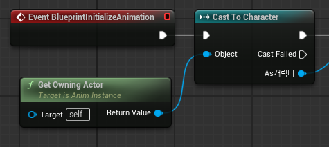

# TIL 4.17
<h3>알고리즘 문제 풀이</h3>
<h4>2131 로봇 명령</h4>

* 알고리즘
    * dp(다이나믹 프로그래밍)
    * 시뮬레이션
    * 구현

* 아이디어
    1. 스캔되는 위치를 저장
    2. 시작 지점(0,0)부터 스캔되는 위치 상하좌우을 dp로 저장(명령 횟수, x, y)
    3. 마지막 스캔지점의 상하좌우 중 가장 작은 값 출력

---
<h3>언리얼 심화 라이브 세션</h3>
<h4>어떤 코드가 좋은 코드인가</h4>

* 긴 매개변수 
    * 매개변수가 많으면 읽거나 이해하기 어려움
    * Struct로 묶어 관리
* 전역 데이터의 남용
    * 접근 경로의 명확성
        * 반드시 서브시스템과 같은 매니저를 거치기
    * 캡슐화의 강제
        * 전역 변수는 데이터 자체가 노출되지만, 서브시스템은 클래스이므로 Setter/Getter나 Delegate을 사용해 데이터 변화 감시 가능
    * 생명 주기의 자동화(Clean)
        * 전역 변수: 수동으로 초기화 필요
        * 서브시스템: 맵이 바뀌거나 꺼지면 엔진이 인스턴스 자체를 파괴
* 가변 데이터

<h4>컨테이너와 포인터</h4>

* TObjectPtr
    UE5에서 도입된 템플릿 스마트 포인터<br>

    * 원시 포인터를 대체하기 위해 도입
        > USceneComponent* -> TObjectPtr<USceneComponent>
    * 성능
        성능은 원시 포인터와 TObjectPtr가 동일

* TSubclassOf

    UClass*을 더 안전하게 제한해서 다루는 탬플릿 타입

    ---  
    * 특정 부모 클래스를 상속한 클래스만 담도록 제한 가능
    > TSubclassOf<UActorComponent> MyClass2; -> ActorComponent만 표시됨

    * 범위 기반 for와 포인터
        > for (TObjectPtr\<USceneComponent>& Component : Components)
        
        >for (auto& Component : Components)
        
        * 배열 안의 원소 자체를 참조로 받음
        * 배열 원소를 직접 수정할 때 적합
        * auto는 받을 타입이 명확한 경우에만 사용

        ---
        > for(USceneComponent* Component : Components)

        * 내부적으로 UObject 포인터처럼 사용 가능하므로 실제 객체 포인터만 꺼내서 씀
        * 읽기용 순회에 적합

    
* 컨테이너
    * TArray: 연속 메모리 레이아웃
        * 특징
            * 캐시 친화적 공간
            * 인덱스 접근 가능
            * 빈번한 랜덤 접근이 필요한 경우
        * 사용 함수
            * Add(value): 배열 끝에 원소 추가(값을 복사해 추가)
            * Emplace(value): 배열 내부에서 원소를 직접 생성
            * AddUnique(value): 같은 값이 없을 때만 추가
            * Insert(value, idx): idx위치에 value 삽입, 뒤 원소들이 밀림
            * Num(): 크기 반환
            * sort(): 내림 차순 정렬, 내부에 람다 함수 사용 가능
            * FilterByPredicate(람다 함수)
            * Find(value): 값의 위치를 찾음
            * Contains(value): 존재 여부 확인
            * Remove(value): value 모두 삭제
            * RemoveSingle(value): 첫번째 값 하나만 삭제
            * RemoveAt(idx): 해당 위치의 값 삭제
            * RemoveAll(람다): 람다에 해당하는 값 삭제
            * Empty(): 배열 내용 모두 제거
        * TSet: 중복 없는 집합 컨테이너
            * 특징
                * 중복 허용 안함
                * 빠른 탐색/ 삽입/ 삭제에 적합
                * 인덱스 접근 불가
                * 자동 정렬
            * 사용 함수
                * Add(value): 추가
                * Contains(value): value 존재 여부
                * Find(value): value의 원소 포인터 반환/ 없으면 nullptr
                * CreateIterator(): .begin()과 유사
                * It.RemoveCurrent: 현재 iterator 값 삭제
                * A.Union(B): A와 B의 합집합
                * A.Intersect(B): A와 B의 교집합
                * Compact():유효값을 앞으로 정리
                * Shrink(): 남는 메모리를 줄입(유효하지 않은 값을 지움), Compact와 세트
                * Array(): 배열로 변환
        * TMap: 키-값 쌍을 저장하는 
            * 특징
                * 키 값 조회 -> 매우 빠름
                * 빠른 탐색/ 삽입/ 삭제에 적합
                * 자동 정렬
            * 사용 함수
                * Add(key, value): 키 - 값 추가
                * Emplace(key, value): 내부 생성
                * Find(value): 값 포인터 반환
                * Contains(value): 키 존재 여부 확인
                * FindOrAdd: 탐색후 반환, 없으면 생성
                * Remove(key): key 제거
                * Compact, Shrink(): Set과 동일

        * 람다 함수: 이름없는 함수
            * []
                * = : 외부 지역 변수 복사해서 사용
                * & : 외부 지역 변수 참조해서 사용
                * : 외부 변수 사용 안함
            * () : 매개 변수 선언
            * {} : 구현부


---
<h3>Cpp과 Unreal Engine으로 3D 게임 개발 </h3>
<h4>캐릭터 동작 구현과 입력 처리하기</h4>

* Character 클래스에 액션 바인딩 추가
    * 입력 액션 연결: 캐릭터 클래스에서 어떤 IA가 들어왔을 때 어떤 함수가 호출될지 바인딩
    * #include "EnhancedInputComponent.h" 사용
    * FInputActionValue: EnhancedInput에서 액션값을 전달할 때 사용하는 구조체
    * BindAction
        * 예시 
            ```
            EnhancedInput->BindAction(
                PlayerController->MoveAction,
                ETriggerEvent::Triggered,
                this,
                &ANBCCharacter::Move
            );
            ```
            * 첫번째 인자: 어떤 UInputAction과 연결할지
            * 두번째 인자: 액션이 발생하는 트리거 이벤트
            * 세번째/네번째 인자: 액션 발생 시 실행할 객체와 함수 포인터
    * Action 구현
        * Walk
            *  value.Get\<FVector2D>()로 FVector2D을 받아옴
            * AddMovementInput(방향, 이동값)으로 이동
                * GetActorForwardVector(): 캐릭터가 바라보는 방향/ 정면
                * GetActorRightVector() : 오른쪽

        * Jump - 기본적으로 제공하는 함수 사용
            * Jump()
            * StopJumping()
        
        * Look 
            * Get\<FVector2D>() 로 FVector 받아옴
            * AddControllerYawInput(LookInput.X): Yaw - 좌우 회전
            * AddControllerPitchInput(LookInput.Y) : Pitch - 상하 회전

        * Sprint
            * GetCharacterMovement()->MaxWalkSpeed의 값을 바꾸어 최대 속도를 조정
                * #include "GameFramework/CharacterMovementComponent.h" 사용

<h4>State Machine 설계를 통한 캐릭터 동작 애니메이션 적용하기</h4>

* Animation Blueprint
    * blueprintInitialize Animation: 애니메이션 블루프린트가 초기화 될때 실행됨
        1. Cast To Chracter와 GetOwningActor을 사용해 연결

            
        2. Character에서 CharacterMovement을 가져와 변수로 승격 및 Set
    * blueprintUpdateAnimation: 매 프레임 실행
        1. Character를 Get으로 가져와 유효한지 확인
        2. Sequence로 X,Y 값 변화량 / 캐릭터 움직임 여부 / 낙하 여부 확인
            1. Movement에서 GetVelocity을 가져옴
            Velocity에서 VectorLengthXY를 사용해 2D 평면상의 속도만 구해 저장
            2. 이동 여부와 사용자 입력을 And로 조합해 캐릭터가 움직이는지 판별
                * charactermovement에서 CurrentAcceleration을 사용해 캐릭터 가속도 값을 받아와 확인
            3. characterMovement에서 isFalling 값을 받아와 확인
    * State Machine
        * State: 캐릭터가 현재 어떤 동작을 하고 있는지 나타냅니다
            *  
        * Transition: 한 상태에서 다른 상태로 전환되는 조건을 정의합니다
    * Blend Space
        인자(캐릭터 속도)를 받아 여러가지의 애니메이션을 부드럽게 혼합하여 재생
        * 1D Blend Space: 값이 하나
        * 2D Blend Space : 값이 2개
    * Control Rig: 애니메이션 로직(상태머신)에서 나온 포즈를 한 번 더 가공하거나, Foot IK(지형이 울퉁불퉁해도 발을 지면에 맞추는 기능)등을 적용하기 위해 사용
        * Detail 창에서 Control Rig Class를 지정
        * Set Initial Trnsforms From Mesh 옵션: 현재 스켈레탈 메쉬의 뼈 변환을 초깃값으로 사용하겠다
        * ShouldDoIKTrace: 실제로 발 위치를 추적할 것인지
    * Locamotion Cached Pose로 저장
        * 기존에 만든 상태 머신을 "New Save cached pose"
    * Apply Additive 노드: 기본 포즈에 Additive Pose을 알파값 만큼 덧붙이는 Anim Blueprint node
    * State Alias: 특정 스테이트를 그룹 지어 별칭을 부여