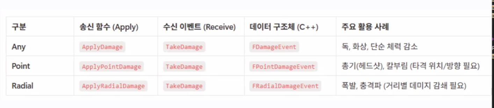

# TIL 4.24
<h3>알고리즘 문제 풀이</h3>
<h4>올바른 괄호의 개수</h4>

* 알고리즘
    * dfs

* 아이디어
    1. dfs로 여는 괄호의 수가 0초과인 경우에 ( 의 개수를 -1
    2. '(' 의 개수와 ')'의 개숫가 다른 경우에 ')'의 개수를 -1 하여 전달
    3. '('의 개수와 ')'의 개수가 0인 경우에 cnt+1
    4. cnt을 반환

* 회고
    1. dp로 풀이를 시도해 보려고 했으나 규칙(카탈린 수)이 보이지 않아서 포기
    2. dfs로 사용 가능한 괄호수를 넘겨 줘서 풀이

---
<h3>언리얼 심화 라이브 세션</h3>
<h4>어떤 코드가 좋은 코드인가</h4>

* 뒤엉킨 변경

    다른 맥락의 동작은 각각 다른 모듈로 분리해 단일 책임을 지키자

* 샷건 수술

    작은 변경을 위해 여러 곳을 동시에 수정해야 하는 상황
    * 관련된 것들은 한군데로 모아 수정 범위를 줄인다

* 기능 편애

    현재 클래스보다 다른 클래스의 함수를 더 많이 씀
    * 함수를 데이터가 있는 곳으로 옮겨 의존성을 줄이기

<h4>Collision & Trace</h4>

* Collision
    * 콜리전
        * Query Only
            * Query(트레이스, 스윕, 오버랩)에 사용됨
            * 물리 처리를 하지 않음
        * Physics Only 
            * 물리 처리를 사용함
            * Query에 사용되지 않음
        * Collision Enabled
            * Query & Physics 모두 사용함
    
    * Collision Preset

        여러 Collision 설정을 미리 묶어둔 프리셋

        * Default
            * Static Mesh or Component가 가진 기본 콜리전 설정을 사용함
        * Custom
            * 각 Trace Channel / Object Channel에 대해 Block, Overlap, Ignore를 직접 설정함

    * Collision Response
        * Ignore: 서로 감지 하지 않음
        * Overlap: 겹침 이벤트를 발생시키고, 물리적으로 막지 않음
        * Block: 서로 막히는 충돌로 처리됨

    * 콜리전 복잡도
        * Collision 종류
            * Simple Collision
                * 단순한 충돌 형태
                * 계산 비용이 낮음
                * 일반적인 이동, 물리 충돌, 기본 트레이스에 사용
            * Complex Collision
            * Static Mesh의 실제 삼각형 메쉬를 기준으로 하는 복잡한 충돌
            * 더 정밀하지만 무거움
            * 정밀한 LineTrace 판정이 필요할 때 사용
        
        * ProjectDefault: 기본 설정을 따름
        * Use Simple Collision As Complex: Simple Collision을 사용
        * Use Complex Collision As Complex: Complex Collision 사용
        * Simple And Complex: 단순 요청 - Simple Collsion / 복잡 요청 - Complex Collision

* Trace

    특정 시작 지점에서 끝 지점까지 선/형태를 검사해서 충돌 대상을 찾는 Query

    * Line Trace

        시작 지점에서 끝 지점까지 직선을 쏴서 충돌 대상을 검사함
        * Start: 트레이스 시작 위치
        * End: 트레이스 끝 위치
        * Trace Channel: 어떤 채널 기준으로 검사할지 정함
        * bTraceComplex: true(Complex Collision), false(Simple Collision)
        * ActorsToIgnore / AddIgnoreActor: 트레이스 검사에서 제외할 Actor 목록
    
    * SingleTrace
        * 첫번째 Blocking Hit를 반환

    * Multi Trace
        * 첫번째 Blocking Hit 까지의 모든 Hit을 반환함
        * Overlap Hit을 포함함

    * 비동기 트레이스

        트레이스 요청을 즉시 받지 않고, 나중에 콜백 함수를 결과를 받는 방식
        * FTraceDelegate: 비동기 트레이스가 끝났을 때, 호툴될 콜백 함수 바인딩
        * AsyncLineTraceByChannel: UWorld에서 제공하는 비동기 라인트레이스 함수
        * EAsyncTraceType::Single: 단일 결과를 요청
        *  EAsyncTraceType::Multi: 여러 결과를 요청

    * UKismetSystemLibrary
        
        Kismet 계열 함수 / Draw Debugg 옵션이 함수 인자로 포함되어 잇어 디버깅 선을 그리기 편함
        
        * LineTraceSingle(): 첫번째 Blocking Hit을 반환

        * LineTraceMulti(): 첫번째 Blocking Hit까지의 Hit들을 반환
        
        * EDrawDebugTrace
            * None: 그리지 않음
            * ForOneFrame: 한 프레임만 
            * ForDuration: 항상 그림
            * Persistent: 계속 남김
    
    * UWorld / GetWorld()
        Cpp에서 UWorld의 트레이스 함수를 직접 호출하는 방식
        * FCollisionQueryParams, FCollisionResponseParams 등을 직접 구성할 수 있음
        * Debug Drawing은 따로 구현 해야함

* DamageType

    

    * TakeDamage
        ```
        float TakeDamage(
            float DamageAmount,
            FDamageEvent const& DamageEvent,
            AController* EventInstigator,
            AActor* DamageCauser
        )
        ```
        * DamageAmount: 전달된 데미지 수치
        * DamageEvent: 데미지 타입, 데미지 방식 등 데미지에 대한 부가 정보
        * EventInstigator: 데미지를 발생 시킨 주체의 Controller
        * DamageCauser: 데미지를 발생시킨 Actor
    
    * DamageTypeClass: 이번 데미지가 어떤 데미지 타입인지 나타내는 클래스 정보
---
<h3>Cpp과 Unreal Engine으로 3D 게임 개발 </h3>
<h4>충돌 이벤트로 획득되는 아이템 구현하기</h4>

* TimerHandler

    동일한 delagate을 가진 타이머들을 구분하는데 사용할 수 있는 고유 핸들
    * TimerManager

        타이머들을 등록하고, 시간이 지났는지 확인하고, 시간이 되면 함수를 호출하는 관리자 

    * SetTimer

        타이머 매니저에게 예약을 거는 함수
        ```
        GetWorld()->GetTimerManager().SetTimer(
            ExplosionTimerHandle,
            this,
            &AMineItem::Explode,
            ExplosionDelay,
            false
        );
        ```
        * 인자
            * 식별자(ExplosionTimerHandle): 특정 타이머를 다시 찾기 위한 식별자
            * 대상 객체(this): 함수가 호출될 대상 객체
            * 실행 함수
            * 대기 시간
            * 반복여부(생략됨)  
    
    ---
<h4>아이템 스폰 및 레벨 데이터 관리하기</h4>

* BoxCollision->GetScaleBoxExtent(): Box Collision의 스케일 값을 가져옴

* DataTable
    1. 엑셀(CSV) or JSON 파일로 관리하여 임포트
    2. 언리얼 엔진에서 제공하는 기본 구조체(FTableRowBase)사용
    * FTableRowBase

        "이 구조체는 데이터 테이블로 쓸 수 있다"라고 인식하게 해주는 베이스 구조체
    * Data Table 생성 -> FItemSpawnRow(Row Structure) -> 데이터 편집
        * RowName : 키와 유사 / 고유한 값이어야함
        * ItemName
        * ItemClass
        * Spawnchance: 확률 합이 100이어야함

* 레퍼런스
    * TSubclassOf - 하드 레퍼런스

        항상 메모리에 로드된 상태에서 바로 접근
    * TSoftclassPtr - 소프트 레퍼런스

        클래스의 경로만 유지

* 랜덤 아이템 스폰(확률 합)
    1. 모든 행(AllRows) 가져오기
    2. 전체 확률 합 구하기
        1. AllRows을 순회
        2. Row가 유효한지 확인 후 SpawnChance 값을 TotalChance에 더하기
    3. 0 ~ TotalChance 사이 랜덤값 구하기
    4. 누적 확률로 아이템 선택