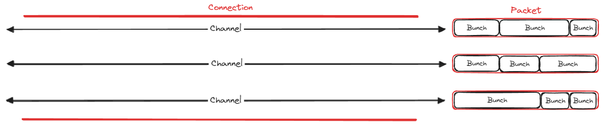

# TIL 6.15
<h3>알고리즘 문제 풀이</h3>
<h4>입국 심사
</h4>

* 알고리즘
    * 이분 탐색

* 아이디어
    1. 0부터 최악의 경우 (가장 오래 걸리는 검사관의 시간 * 인원수)을 범위로 이분 탐색
    2. 범위의 중간 값인 mid을 구하고, 그 시간 안에 모든 사람이 검사받을 수 있는지 확인
        1. 모든 사람이 가능 -> 범위의 max을 mid-1로 초기화
        2. 모든 사람이 불가능 -> 범위의 min을 mid+1로 초기화
    3. 모든 사람이 검사 가능한 mid 값중 최솟값을 반환

---
<h3>Unreal Engine 멀티플레이어 게임 개발</h3>
<h4>게임 플레이 프레임 워크</h4>

* checkf(조건, format)

    언리얼 엔진의 조건 검증(assert) 매크로 
    조건이 false면 오류메시지와 호출 스택을 출력하고 실행을 중단함

---
<h4>멀티플레이 디버그 로깅과 이벤트 함수</h4>

* 서버와 클라이언트의 로그를 확인하기 위해서
    * Launch Separate Server -> false
    * Run Under One Process -> true

* PreLogin()

    클라이언트가 서버에 접속할 수 있는지 검사하는 함수

    * ErrorMessage.IsEmpty() == true -> 접속 허용
    * ErrorMessage.IsEmpty() == false -> 접속 거부, 접속 실패 사유로 클라이언트에 전달

    * 실행 순서
        1. UWorld가 GameMode-> PreloginAsync() 호출
        2. 가상함수인 커스텀 PreLogin() 전체 실행
        3. PreLogin()이 끝난 뒤 최종 ErrorMessage을 OnComplete에 전달
        4. UWorld::PreLoginComplete()가 최종 결과 검사
            1. 성공 -> WelcomePlayer()
            2. 실패 -> 메시지 전송 후 연결 종료

* 서버에서의 NetConnection(ClientConnection) 확인 -> GameModeBase::PostLogin()
* 클라이언트에서의 NetConnection(ServerConnection) 확인 -> PlayerController::PostNetInit()

* 넷 커넥션

    서버와 클라이언트 사이의 하나의 네트워크 연결을 관리하는 객체

    > 채널 관리, Bunch 전송, Packet 생성 및 송수신 등의 연결 단위의 네트워크 처리를 담당

    * 클라이언트 - 서버 구조
        * 서버 - 접속한 클라이언트의 갯수만큼 가짐
        * 클라이언트 - 서버와의 단 하나의 넷커넥션을 가짐
    ---
* 채널

    하나의 `NetConnection` 안에서 데이터를 용도별로 분리하여 처리하기 위한 논리적인 통신 경로

    > `UChannel`은 통신 채널의 기반 클래스이며, `FOutBunch` 송신과 `FInBunch` 수신을 처리
    * 패킷
    * 번치
    ---
* Bunch
    채널이 송수신하는 데이터 묶음

    > 프로퍼티 변경 내용, RPC, 제어 메시지 등의 직렬화된 데이터 및 채널 처리용 정보

    * 채널 처리용 정보
        * 어떤 채널의 데이터인지
        * Reliable 여부
        * 채널을 열거나 닫는 데이터인지
        * 분할된 Bunch인지
    ---
* Packet

    `NetConnection`이 실제 네트워크를 통해 송수신하는 전송 단위

    > Bunch 데이터는 NetConnection의 송신 버퍼에 기록되고, 이후 Packet으로 묶여 저수준 네트워크 계층으로 전달
    
    > 하나의 Packet에는 여러 Bunch의 데이터가 들어갈 수 있으며, Bunch가 너무 크면 여러개의 Partial Bunch로 분할될 수 있음

* BeginPlay() 호출 과정
    * 서버에서 `GameModeBase::StartPlay()`가 호출되지 않으면 게임 시작 처리가 되지 않아 월드의 Actor들의 `BeginPlay()`도 호출되지 않음
    * 서버의 `StartPlay()`는 HandleBeginPlay()를 호출하고, 월드의 각 Actor을 대상으로 `NotifyBegionPlay()` 수행

    * 흐름도
        * 서버
            1. GameModeBase::StartPlay()
            2. GameStateBase::HandleBeginPlay()
            3. WorldSettings::NotifyBeginPlay()
            4. Actor::DispatchBeginPlay()
            5. Actor::BeginPlay()
        * 클라이언트
            1. bReplicateHasBegunPlay 복제
            2. GameStateBase::OnRep_ReplicatedHasBegunPlay()
            3. WorldSettings::NotifyBeginPlay()
            4. Actor::DispatchBeginPlay()
            5. Actor::BeginPlay()

* 시작 관련 주요 이벤트 함수
    * PostInitalizeComponents()

        Actor에 속한 컴포넌트들의 초기화가 완료된 후 호출되는 함수

        > 액터가 게임에서 동작하기 위한 기본적인 컴포넌트 구성이 준비된 시점에 실행(일반적으로 BeginPlay()보다 먼저 호출)
    * PostNetInit()

        클라이언트에서 네트워크를 통해 Actor가 생성되고, **최초 복제 데이터가 해당 Actor에 적용된 직후 호출**되는 함수
    
    * StartPlay

        서버의 GameModeBase에서 게임 시작 처리를 진행하는 함수

        > 월드에 존재하는 Actor들이 BeginPlay() 단계로 전환되도록 하는 진입점

    * BeginPlay

        Actor가 실제 게임 플레이를 시작할 준비가 되었을 때 호출되는 함수
